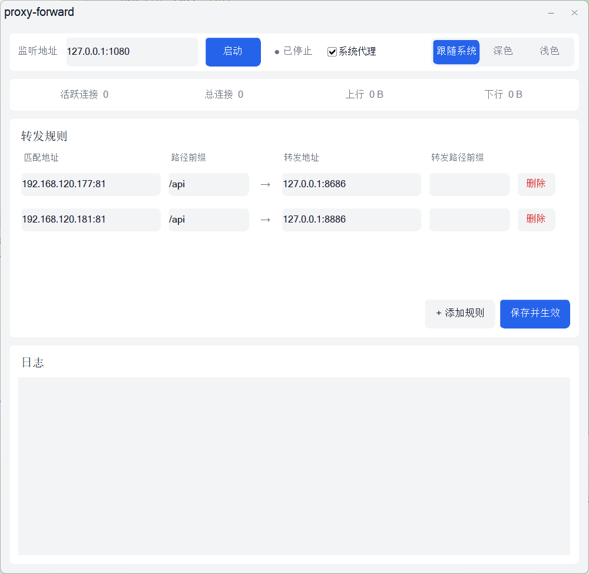
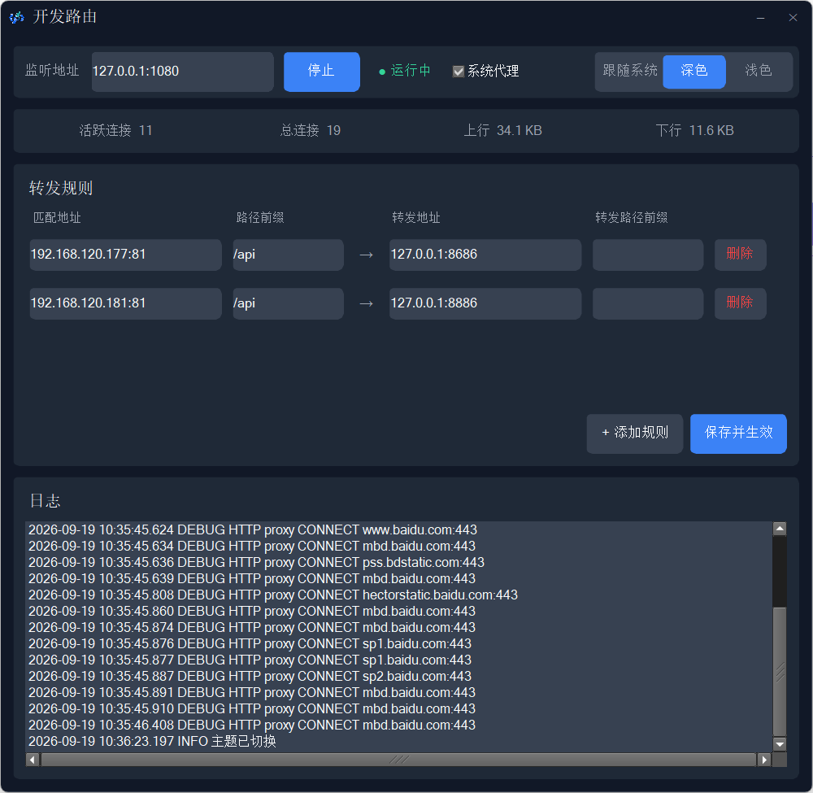

# devroute（开发路由）


> 本地开发调试用的转发工具：**极致轻量，内存占用仅 3.5MB 起（无界面模式 1.6MB）**，2MB 单文件即拷即用。单端口同时支持 SOCKS5 和 HTTP 代理协议，按 `Host + 路径前缀` 转发并支持路径重写。带 GUI（规则编辑 / 实时统计 / 日志 / 系统代理联动），Rust 编写。

## 截图

| 浅色主题 | 深色主题 |
|---|---|
|  |  |

## 特性

- **双协议代理**：同一监听端口自动识别 SOCKS5 与 HTTP 代理（CONNECT + 绝对路径请求）
- **规则转发**：按 `Host:Port` + 请求路径前缀匹配，转发到目标地址并重写路径前缀
- **GUI 桌面端**（默认）：规则增删改、保存热重载、连接/流量统计、实时日志、一键系统代理、深浅色主题切换
- **轻量**：GUI 空闲约 3.5MB 内存（开启代理 ~4MB，随请求量增长）；`--headless` 无界面模式启动仅 ~1.6MB，适合常驻
- 自动生成默认 `config.toml`，配置文件改动即时生效
- 转发失败可返回 503 或回退原始地址

## 快速开始

### 构建要求

- Rust（edition 2024）
- Windows: CMake + MSVC（fltk 需要编译 C++，`winget install Kitware.CMake`）
- macOS / Linux: cmake + C++ 工具链

### 运行

```bash
# GUI 模式（默认）
cargo run --release

# 无界面代理模式
cargo run --release -- --headless
```

首次运行会在当前目录生成默认 `config.toml`。

### 打包分发

```bash
cargo build --release
```

产物是单文件 `target/release/devroute.exe`（Windows），所有依赖（含 fltk GUI）静态链接，无需安装任何运行时，拷贝到任意目录双击即用。

- 双击 / 直接运行 → GUI 模式
- `devroute.exe --headless` → 无界面代理模式

注意：配置文件读取的是**程序运行时所在的目录**下的 `config.toml`，不存在则自动生成默认配置。

### GUI 使用

- **监听地址**：本地代理端口，默认 `127.0.0.1:1080`
- **系统代理**：勾选后，启动时代理自动写入系统设置（Windows 注册表 / macOS networksetup / Linux gsettings），停止或关窗时自动取消
- **转发规则**：匹配地址 + 路径前缀 → 转发地址 + 路径前缀，点击"保存并生效"写入 `config.toml` 并热重载（改监听地址会自动重启代理线程）
- **主题**：右上角分段控件，跟随系统 / 深色 / 浅色，即时切换并记忆

## 配置规则

`config.toml` 示例：

```toml
listen_addr = "127.0.0.1:1080"
theme = "system"        # system | dark | light（GUI）
auto_proxy = false      # 启动时自动设置系统代理（GUI）

[[rules]]
matcher = { addr = "192.168.120.177:81", path_prefix = "/api" }
forward = { addr = "127.0.0.1:8686", path_prefix = "" }
```

字段说明：

- `matcher.addr`：待匹配的目标 `Host:Port`，支持 `*` 匹配所有
- `matcher.path_prefix`：需要匹配的请求路径前缀
- `forward.addr`：转发目标地址
- `forward.path_prefix`：转发时替换原路径前缀的目标前缀（留空 = 去掉前缀）

例：请求 `http://192.168.120.177:81/api/users` → 转发为 `http://127.0.0.1:8686/users`

## 使用方式

### 方式一：系统代理（推荐）

GUI 勾选"系统代理"后启动即可，浏览器和大多数应用自动走代理。

### 方式二：ZeroOmega 浏览器插件

1. Chrome/Edge 安装 `ZeroOmega` 扩展
2. 添加代理：类型 `SOCKS5`，地址 `127.0.0.1:1080`（或直接填 `socks5://127.0.0.1:1080`）
3. 按需配置规则：全局走代理由 `config.toml` 分流，或只把目标调试域名设为走代理

## 示例场景

### 本地 API 转发

浏览器访问 `http://192.168.120.177:81/api/test` → 转发到 `http://127.0.0.1:8686/test`

### 多域名分流

```toml
[[rules]]
matcher = { addr = "api.example.com:80", path_prefix = "/service" }
forward = { addr = "127.0.0.1:8080", path_prefix = "/" }

[[rules]]
matcher = { addr = "*", path_prefix = "/static" }
forward = { addr = "127.0.0.1:8090", path_prefix = "/assets" }
```

## 项目结构

```text
src/
  main.rs            # 入口：--headless 走命令行，否则起 GUI
  daemon.rs          # 代理后台线程（tokio runtime + 命令通道 + 热重载）
  core/
    socks.rs         # SOCKS5 处理 + 协议嗅探（首字节 0x05 判定）
    http.rs          # HTTP 路径重写 + HTTP 代理（CONNECT / absolute-form）
    route.rs         # 路由规则匹配（RwLock 热更新）
    config.rs        # 配置加载/保存（内联表 TOML）
    stats.rs         # 连接/流量原子计数
  ui/
    mod.rs           # GUI 入口：主题检测、事件循环、日志通道
    view.rs          # 界面构建与扁平化样式（fltk）
    controller.rs    # 业务逻辑：启停、规则编辑、保存、系统代理、主题切换
```

## License

MIT
